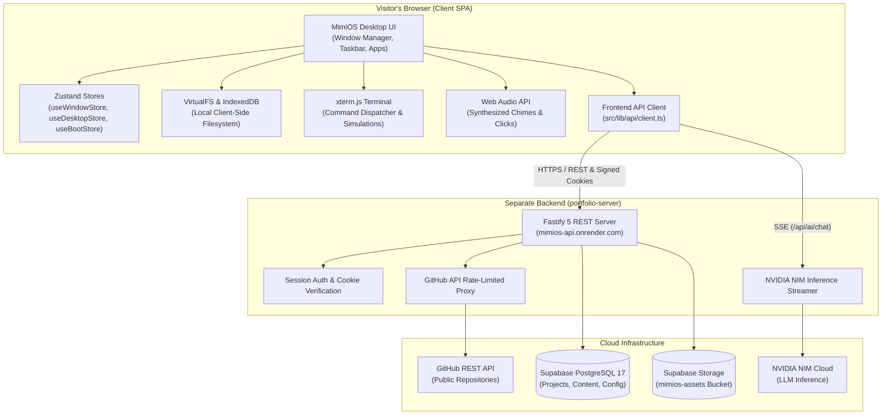

# MimiOS

> **A browser-based desktop operating system & interactive developer portfolio.**  
> Reimagining personal portfolio discovery through a Linux-inspired desktop environment, virtual filesystem, terminal shell, and an AI-driven cybersecurity companion.

[](https://react.dev/)
[](https://www.typescriptlang.org/)
[](https://vite.dev/)
[](https://github.com/pmndrs/zustand)
[](#what-is-mimios)
[](#architecture-and-data-flow)

---

**Quick Links:**  
[Live Demo](https://mimios.onrender.com) &bull; [Frontend Repository](https://github.com/pratyushrobert/portfolio) &bull; [Backend Repository](https://github.com/pratyushrobert/portfolio-server) &bull; [Issue Tracker](https://github.com/pratyushrobert/portfolio/issues)

---

## Table of Contents

- [What is MimiOS?](#what-is-mimios)
  - [Motivation](#motivation)
  - [The Desktop Metaphor](#the-desktop-metaphor)
  - [Simulation vs. Native OS](#simulation-vs-native-os)
- [Preview Gallery](#preview-gallery)
- [Feature Overview](#feature-overview)
  - [Desktop and Window Management](#desktop-and-window-management)
  - [Application Launcher and Taskbar](#application-launcher-and-taskbar)
  - [Virtual Filesystem (VirtualFS)](#virtual-filesystem-virtualfs)
  - [Terminal and Command Shell](#terminal-and-command-shell)
  - [Portfolio Showcase Applications](#portfolio-showcase-applications)
  - [MimiAI: Cyber Ninja Cat Companion](#mimiai-cyber-ninja-cat-companion)
  - [Personalization and Settings](#personalization-and-settings)
  - [Audio Subsystem](#audio-subsystem)
  - [Admin Management Portal](#admin-management-portal)
- [Technology Stack](#technology-stack)
- [Architecture and Data Flow](#architecture-and-data-flow)
- [Project Structure](#project-structure)
- [Getting Started](#getting-started)
  - [Prerequisites](#prerequisites)
  - [Installation](#installation)
  - [Local Development](#local-development)
  - [Connecting to the Backend](#connecting-to-the-backend)
- [Environment Configuration](#environment-configuration)
- [Application Guide](#application-guide)
  - [Desktop Applications](#desktop-applications)
  - [Keyboard Shortcuts and Window Controls](#keyboard-shortcuts-and-window-controls)
- [MimiAI Architecture and Safety](#mimiai-architecture-and-safety)
  - [Inference Pipeline](#inference-pipeline)
  - [Approved Tool Registry](#approved-tool-registry)
  - [Safety Boundaries and Guardrails](#safety-boundaries-and-guardrails)
- [Backend Integration](#backend-integration)
- [Security and Privacy Safeguards](#security-and-privacy-safeguards)
- [Troubleshooting](#troubleshooting)
- [Development and Contribution](#development-and-contribution)
  - [Available Scripts](#available-scripts)
  - [Testing Status](#testing-status)
  - [Contributing](#contributing)
- [Roadmap](#roadmap)
- [License and Acknowledgements](#license-and-acknowledgements)
- [Contact and Links](#contact-and-links)

---

## What is MimiOS?

### Motivation
Traditional software portfolios are static, two-dimensional landing pages. While effective for reading a resume, they rarely demonstrate how a software engineer thinks about system design, interactive state machines, client performance, and user experience.

**MimiOS** transforms personal portfolio presentation into an immersive, interactive browser desktop environment. Instead of scrolling through standard cards and text blocks, visitors explore projects, work history, verified certifications, and technical skills through functional desktop windows, an in-browser virtual filesystem, an interactive terminal shell, and an integrated AI companion.

### The Desktop Metaphor
MimiOS reproduces core desktop operating system conventions directly inside the browser viewport:
- **Multi-Window Management:** Draggable, resizable, minimizable, and maximizable windows with active z-index stacking.
- **System Taskbar & Dock:** Running application badges, window preview popovers, persistent clock, and quick-launch icons.
- **Unified Application Launcher:** Fast searchable menu indexing all installed tools and portfolio apps.
- **Connected Ecosystem:** Portfolio data is not isolated—it is navigable via GUI windows, queryable in the terminal (`open projects`, `cat /home/pratyush/about.txt`), and accessible through natural language queries with MimiAI.

### Simulation vs. Native OS
> [!NOTE]
> **Architectural Transparency:**  
> MimiOS is a high-performance **browser-based Single Page Application (SPA)** built with React 19, TypeScript, and modern web APIs. It simulates Linux/Unix concepts (such as POSIX directory trees, terminal command dispatch, and desktop window managers) in the browser DOM.  
> 
> It does **not** run a native kernel, WebAssembly hypervisor, or container engine, and it does not possess raw OS socket or hardware access. All cybersecurity inspection tools (`scan`, `packetmon`, `wifiscan`) are carefully engineered educational simulations.

---

## Preview Gallery

*Visual previews of the MimiOS desktop environment. Screenshots will be added as visual assets are captured from the production build.*

| Module | Interface Preview |
|---|---|
| **Boot & Welcome** | <!-- SCREENSHOT PLACEHOLDER: Boot experience and login sequence --> `[Preview Placeholder — Boot Sequence & Welcome Screen Coming Soon]` |
| **Desktop Environment** | <!-- SCREENSHOT PLACEHOLDER: Full desktop workspace with multi-window layout --> `[Preview Placeholder — Multi-Window Workspace & Liquid Glass Aesthetic Coming Soon]` |
| **Launcher & Taskbar** | <!-- SCREENSHOT PLACEHOLDER: Application launcher search and taskbar dock --> `[Preview Placeholder — Application Launcher & System Taskbar Coming Soon]` |
| **File Manager & VFS** | <!-- SCREENSHOT PLACEHOLDER: VirtualFS browser and directory tree view --> `[Preview Placeholder — File Manager & IndexedDB VirtualFS Coming Soon]` |
| **MimiAI Companion** | <!-- SCREENSHOT PLACEHOLDER: MimiAI chat interface with streaming responses --> `[Preview Placeholder — MimiAI Cyber Ninja Cat Interface Coming Soon]` |
| **Terminal & Shell** | <!-- SCREENSHOT PLACEHOLDER: xterm.js terminal with cybersecurity telemetry --> `[Preview Placeholder — xterm.js Terminal and Command Shell Coming Soon]` |
| **Portfolio Showcase** | <!-- SCREENSHOT PLACEHOLDER: Projects, Skills, and Experience windows --> `[Preview Placeholder — Interactive Portfolio & Project Cards Coming Soon]` |
| **Admin Portal** | <!-- SCREENSHOT PLACEHOLDER: Admin dashboard and content management --> `[Preview Placeholder — Admin Management Portal Coming Soon]` |

---

## Feature Overview

### Desktop and Window Management
- **Fluid Windowing System:** Multi-window window manager built with Zustand (`useWindowStore`), supporting cascade positioning, snapping, boundary-clamped dragging, and resizable edges.
- **Liquid Glass Aesthetic:** Translucent dark surfaces with customizable backdrop blur (`0px` to `30px`, defaulting to `5px`), subtle border highlights, and dark-theme contrast.
- **State Preservation:** Minimizing or backgrounding an application preserves component state without remounting.

### Application Launcher and Taskbar
- **Quick-Access Launcher:** Searchable directory of all installed applications, categorized into system utilities, portfolio views, and entertainment.
- **Active Taskbar:** Visual indicator for running apps, active focus highlights, and one-click minimize/restore.
- **System Tray:** Live system clock, volume toggle, and connection status indicator.

### Virtual Filesystem (VirtualFS)
- **Hierarchical Directory Tree:** In-browser virtual filesystem simulating a POSIX structure (`/`, `/bin`, `/etc`, `/home/pratyush`, `/usr`).
- **IndexedDB Persistence:** File modifications, newly created files, and custom directories persist across browser refreshes using client-side IndexedDB storage.
- **Dual Representation:** File Manager GUI and Terminal shell share the exact same underlying `VirtualFS` singleton, ensuring actions in the terminal immediately reflect in the GUI.

### Terminal and Command Shell
- **xterm.js Integration:** Hardware-accelerated terminal emulator utilizing `xterm`, `xterm-addon-fit`, and `xterm-addon-web-links`.
- **35+ Built-in Commands:**
  - *Filesystem Navigation:* `ls`, `cd`, `pwd`, `tree`, `stat`, `find`.
  - *File Operations:* `cat`, `touch`, `mkdir`, `rm`, `cp`, `mv`, `echo`.
  - *System Information:* `whoami`, `uname`, `hostname`, `neofetch`, `motd`, `history`, `clear`.
  - *Application Control:* `open <app>`, `mimi`, `ai`, `snake`.
  - *Simulated Cybersecurity Utilities:* `scan` (port audit simulation), `packetmon` (network telemetry inspector), `wifiscan` (spectrum analyzer), `seclog` (security event journal), `base64`, `hash`, `challenge`, `achievements`.

### Portfolio Showcase Applications
- **About Me:** Developer background, biography, engineering philosophy, and quick stats.
- **Projects:** Filterable showcase of featured software engineering and security projects, complete with architecture highlights, technology badges, and links to GitHub repositories and live deployments.
- **Skills:** Interactive taxonomy of programming languages, frameworks, cloud platforms, and cybersecurity proficiencies.
- **Experience:** Chronological career timeline detailing professional roles, responsibilities, and achievements.
- **Certificates:** Verified credentials, industry accreditations, and verification links.
- **Resume Viewer:** Built-in PDF reader powered by `pdfjs-dist` for reading and downloading developer resumes without leaving the desktop.
- **Contact:** Direct channels for professional inquiries, encrypted communication, and social links.

### MimiAI: Cyber Ninja Cat Companion
- **AI-Powered Exploration:** Interactive desktop companion with a cyber ninja cat persona, powered by NVIDIA NIM inference models.
- **Real-Time Streaming:** Server-Sent Events (SSE) deliver low-latency streaming responses with markdown formatting.
- **Approved OS Action Execution:** Safely interacts with MimiOS by triggering validated actions (`open_app`, `close_app`, `focus_app`, `navigate_filesystem`).

### Personalization and Settings
- **Wallpaper Engine:** Dynamic desktop wallpaper selection with support for custom image URLs and live preview.
- **Glass Blur Slider:** Real-time adjustment of global backdrop blur (`0px` to `30px`, step `1px`, default `5px`).
- **Audio Controls:** Individual toggles for sound effects and boot chimes.

### Audio Subsystem
- **Web Audio API Synthesis:** Zero-dependency audio synthesis generating clean harmonic boot chimes (C4-G4-C5 triad) and subtle UI interaction sounds.
- **Autoplay Handling:** Gracefully handles browser autoplay policies without interrupting boot flow or throwing unhandled exceptions.

### Admin Management Portal
- **Protected Content Management:** Administrative interface for updating portfolio content, creating projects, adjusting site settings, and uploading media.
- **Session Authentication:** Integrates with backend signed cookie sessions (`/api/auth/login`, `/api/auth/logout`, `/api/auth/me`).

---

## Technology Stack

### Frontend Dependencies

| Package | Version | Purpose |
|---|---|---|
| **[react](https://react.dev/)** / **react-dom** | `^19.2.8` | Core component framework leveraging modern concurrent features |
| **[typescript](https://www.typescriptlang.org/)** | `~6.0.2` | Strict compile-time type safety across all subsystems |
| **[vite](https://vite.dev/)** | `^8.3.0` | Ultra-fast development server with Rollup-based production bundling |
| **[zustand](https://github.com/pmndrs/zustand)** | `^5.0.0` | Lightweight, unopinionated client state management (window, desktop, boot) |
| **[lucide-react](https://lucide.dev/)** | `^0.468.0` | Crisp, tree-shakeable SVG icon set for desktop and applications |
| **[xterm](https://xtermjs.org/)** | `^5.3.0` | Full-featured web terminal emulator |
| **xterm-addon-fit** / **xterm-addon-web-links** | `^0.8.0` / `^0.9.0` | Terminal auto-resizing to container bounds & clickable link detection |
| **[pdfjs-dist](https://mozilla.github.io/pdf.js/)** | `^4.10.38` | In-browser PDF parsing and canvas rendering for the Resume app |
| **[markdown-it](https://github.com/markdown-it/markdown-it)** | `^14.1.0` | Fast markdown parser for portfolio copy and MimiAI streaming text |
| **[react-resizable-panels](https://github.com/bvaughn/react-resizable-panels)** | `^2.1.0` | Smooth, accessible split-pane layouts for File Manager and Editor |
| **[uuid](https://github.com/uuidjs/uuid)** | `^11.0.0` | Unique identifier generation for windows, VFS nodes, and session events |
| **[date-fns](https://date-fns.org/)** | `^4.1.0` | Standardized date formatting and timeline calculations |
| **[oxlint](https://oxc.rs/)** | `^1.81.0` | High-speed Rust-based JavaScript/TypeScript linter |
| **Bespoke CSS Design Tokens** | Native CSS | Plain CSS Custom Properties; no heavy utility or CSS-in-JS dependencies |

### Backend Architecture Overview
Backend services are maintained in a separate repository:  
👉 **[MimiOS Backend Repository](https://github.com/pratyushrobert/portfolio-server)**

The backend is built with **Fastify 5**, utilizing **PostgreSQL** (via Supabase) for relational storage, **Supabase Storage** for media uploads, and **NVIDIA NIM** for AI inference. The frontend connects to the backend over a REST API and Server-Sent Events (SSE).

---

## Architecture and Data Flow

MimiOS enforces a strict separation of concerns between client-side UI simulation and server-side privileged services:



### Request Flow Principles
1. **No Direct Database Access:** The browser never holds database connection strings or connects directly to PostgreSQL. All persistence routes pass through Fastify.
2. **Stateless Frontend Security:** The frontend bundle contains zero API keys or secrets. AI provider tokens (`NVIDIA_API_KEY`) and storage service keys are held strictly in server environment variables.
3. **Local VirtualFS Isolation:** The in-browser `VirtualFS` operates entirely in browser memory and IndexedDB. Guest files created in the browser are never uploaded to the backend server.

---

## Project Structure

```
pratyushos/
├── public/                      # Static web assets served at domain root
│   ├── favicon.svg              # Browser tab icon
│   └── icons.svg                # SVG sprite sheet for system icons
├── src/
│   ├── assets/                  # Bundled static images and media
│   ├── components/              # React UI components organized by subsystem
│   │   ├── admin/               # Admin portal login and management forms
│   │   ├── ai/                  # MimiAI assistant chat interface & mascot UI
│   │   ├── boot/                # Hardware boot sequence and login screens
│   │   ├── desktop/             # Desktop canvas, wallpaper, taskbar, launcher
│   │   ├── editor/              # Lightweight text and code editor
│   │   ├── file-manager/        # File Manager graphical browser
│   │   ├── game/                # Cyber Snake arcade mini-game
│   │   ├── image-viewer/        # Standalone image inspection window
│   │   ├── pdf-viewer/          # PDF rendering canvas wrapper
│   │   ├── portfolio/           # Portfolio showcase apps (About, Projects, Skills, etc.)
│   │   ├── settings/            # System preferences, wallpaper, blur controls
│   │   ├── terminal/            # xterm.js terminal component and shell wrapper
│   │   ├── text-viewer/         # Read-only document viewer
│   │   ├── ui/                  # Reusable low-level UI primitives
│   │   ├── video-player/        # Video playback container
│   │   └── window/              # Window frame, drag handles, controls, titlebar
│   ├── hooks/                   # Custom React hooks (window resizing, keyboard)
│   ├── lib/                     # Non-React utilities and business logic
│   │   ├── admin/               # Admin state helpers
│   │   ├── ai/                  # MimiAI action registry and tool executor
│   │   ├── api/                 # Typed backend HTTP client and route definitions
│   │   ├── audio/               # Web Audio API synthesizers for chimes & clicks
│   │   ├── auth/                # Client-side session state listener
│   │   ├── easterEggs/          # System surprises and terminal shortcuts
│   │   ├── terminal/            # Shell commands registry and implementation
│   │   ├── ui/                  # Design helpers and color calculations
│   │   ├── vfs/                 # In-browser VirtualFS with IndexedDB backing
│   │   ├── discovery.ts         # Portfolio achievement/discovery tracker
│   │   ├── icons.ts             # Application icon mappings
│   │   └── welcomeQuotes.ts     # Startup system quote generator
│   ├── stores/                  # Zustand stores
│   │   ├── useBootStore.ts      # Boot progress, power state, login session
│   │   ├── useDesktopStore.ts   # Wallpaper, glass blur, active theme, audio
│   │   └── useWindowStore.ts    # Window stack, focus, minimization, geometry
│   ├── types/                   # Global TypeScript interfaces
│   ├── App.tsx                  # Root application component
│   ├── App.css                  # Core application styling
│   ├── index.css                # Global CSS variables, design tokens, reset
│   └── main.tsx                 # Vite entry point
├── .env                         # Frontend local environment configuration
├── .gitignore                   # Git ignore patterns
├── .oxlintrc.json               # Oxlint configuration
├── DEPLOYMENT.md                # Production deployment documentation
├── package.json                 # Dependencies and npm scripts
├── tsconfig.json                # TypeScript project references root
├── tsconfig.app.json            # Client application TypeScript rules
├── tsconfig.node.json           # Node/Vite TypeScript rules
└── vite.config.ts               # Vite configuration and backend dev proxy
```

---

## Getting Started

### Prerequisites
- **Node.js:** `>= 20.0.0` (LTS recommended)
- **npm:** `>= 10.0.0`
- **Git**

### Installation
1. Clone the frontend repository:
   ```bash
   git clone https://github.com/pratyushrobert/portfolio.git
   cd portfolio
   ```
2. Install project dependencies:
   ```bash
   npm install
   ```

### Local Development
Start the local Vite development server:
```bash
npm run dev
```
The application will be available at:  
👉 `http://localhost:5173`

### Connecting to the Backend
During local development, `vite.config.ts` automatically proxies API routes:
- Requests to `/api/*`, `/health`, and `/uploads/*` are forwarded to `http://127.0.0.1:3001`.

To run the complete system locally with real authentication and AI inference:
1. Clone and start the backend service following the instructions in the [portfolio-server repository](https://github.com/pratyushrobert/portfolio-server).
2. Ensure the backend is listening on port `3001`.
3. Keep `VITE_API_URL` empty in your frontend `.env` file so the Vite proxy handles all cross-origin requests seamlessly without cookie restrictions.

> [!TIP]
> **Offline Development:**  
> If the backend is not running, the frontend will still load and remain fully interactive. The desktop environment, window manager, VirtualFS, terminal shell, and PDF viewer work entirely offline. Network-dependent features (MimiAI chat, remote GitHub sync, and Admin Portal login) will cleanly display friendly connection notices.

---

## Environment Configuration

The frontend repository reads only a single environment variable.

Create a `.env` file in the project root:

```ini
# .env

# Backend API Base URL
# Leave blank during local development to use Vite's built-in /api proxy.
# In production, set to your deployed backend URL (e.g., https://mimios-api.onrender.com).
VITE_API_URL=
```

### Environment Security Rules

| Variable | Location | Description |
|---|---|---|
| `VITE_API_URL` | Frontend `.env` | Publicly exposed base URL for the backend API |
| `DATABASE_URL` | **Backend Only** | PostgreSQL connection string — **NEVER** expose to frontend |
| `NVIDIA_API_KEY` | **Backend Only** | AI inference credential — **NEVER** expose to frontend |
| `SESSION_SECRET` | **Backend Only** | Fastify cookie signing key — **NEVER** expose to frontend |
| `ADMIN_PASSWORD` | **Backend Only** | Initial administrator password — **NEVER** expose to frontend |
| `SUPABASE_SECRET_KEY` | **Backend Only** | Storage service role secret — **NEVER** expose to frontend |

---

## Application Guide

### Desktop Applications

| Application | ID | Description |
|---|---|---|
| **Terminal** | `terminal` | System command shell powered by `xterm.js` with 35+ commands |
| **File Manager** | `files` | Graphical browser for the in-browser IndexedDB VirtualFS |
| **About Me** | `about` | Developer profile, background, and technical philosophy |
| **Projects** | `projects` | Interactive portfolio showcasing featured engineering projects |
| **Skills** | `skills` | Categorized proficiencies across programming, DevOps, and security |
| **Experience** | `experience` | Career timeline highlighting professional roles and achievements |
| **Certificates** | `certificates` | Verified industry accreditations and security credentials |
| **Resume** | `resume` | Integrated PDF resume viewer powered by `pdfjs-dist` |
| **Code Editor** | `editor` | Lightweight syntax-highlighted editor with VirtualFS save support |
| **Settings** | `settings` | System preferences: wallpaper selection, blur slider, audio toggles |
| **Contact** | `contact` | Direct communication channels and social links |
| **Cyber Snake** | `snake` | Classic arcade game rebuilt with a dark cyberpunk visual theme |
| **MimiAI** | `mimi-ai` | Cyber ninja cat assistant powered by NVIDIA NIM inference |
| **Admin Portal** | `admin-portal` | Authenticated dashboard for portfolio content and asset management |

### Keyboard Shortcuts and Window Controls

- **Focus Window:** Click anywhere within the window boundary.
- **Move Window:** Click and drag the window titlebar.
- **Resize Window:** Click and drag any outer edge or corner resize handle.
- **Minimize Window:** Click the minimize (`—`) button in the titlebar or click the app's taskbar icon.
- **Maximize / Restore:** Click the maximize (`□`) button in the titlebar or double-click the titlebar.
- **Close Window:** Click the close (`✕`) button in the titlebar.
- **Launch from Terminal:** Run `open <app-name>` (e.g., `open projects`, `open resume`, `open files`).

---

## MimiAI Architecture and Safety

MimiAI is designed as a **cyber ninja cat companion** with a distinct personality: witty, concise, knowledgeable in cybersecurity, and focused on defensive principles.

### Inference Pipeline
1. **User Prompt:** Captured in `MimiAIApp.tsx` and validated (empty submissions rejected).
2. **Sanitization:** Sanitized against `src/lib/api/ai.ts` to guarantee strict schema conformance.
3. **Streaming Route:** Dispatched via `POST /api/ai/chat` using `fetch` with `Accept: text/event-stream`.
4. **Backend Gateway:** The backend attaches the `NVIDIA_API_KEY` and calls NVIDIA NIM models.
5. **SSE Parser:** Client receives SSE tokens, rendering markdown incrementally in real time.

### Approved Tool Registry
MimiAI can safely manipulate the desktop environment through a strictly-typed action registry (`src/lib/ai/actions.ts`):

```typescript
type MimiActionName = 
  | 'open_app'            // Opens an approved desktop application
  | 'close_app'           // Closes an open window (requires confirmation for editors)
  | 'focus_app'           // Brings an open application to the foreground
  | 'navigate_filesystem' // Changes directory in the VirtualFS
```

### Safety Boundaries and Guardrails
- **Restricted Applications:** Administrative tools (`admin-portal`, `admin-login`, `admin`) are strictly blacklisted. MimiAI cannot launch or interact with admin panels.
- **Destructive Action Confirmation:** Closing applications with active unsaved state (such as `editor` or `terminal`) requires explicit user confirmation via a modal dialog before execution.
- **Filesystem Confinement:** Filesystem navigation is strictly confined to the in-browser `VirtualFS`. MimiAI cannot inspect or access the visitor's host computer or physical filesystem.
- **Defensive Security Focus:** The AI prompt emphasizes defensive security posture, authorized testing, and ethical guidelines.

---

## Backend Integration

The frontend connects to the backend service maintained at:  
👉 **[github.com/pratyushrobert/portfolio-server](https://github.com/pratyushrobert/portfolio-server)**

### Division of Responsibilities

| Responsibility Area | Frontend (`portfolio`) | Backend (`portfolio-server`) |
|---|---|---|
| **User Interface** | Window management, themes, desktop canvas | None |
| **Virtual Filesystem** | In-browser VFS & IndexedDB storage | None |
| **Authentication** | Login modal UI & session listener | Password hashing (bcrypt) & signed cookies |
| **Persistent Storage** | None | PostgreSQL 17 relational database |
| **Asset Storage** | File picker & upload trigger | Supabase Storage management & CDN redirects |
| **AI Inference** | Chat UI & SSE stream consumer | NVIDIA NIM integration & API key custody |
| **GitHub Discovery** | Repository browser UI | GitHub REST API proxying & rate-limit cache |

Refer to the [portfolio-server README](https://github.com/pratyushrobert/portfolio-server) for database schemas, Fastify route specifications, and server deployment instructions.

---

## Security and Privacy Safeguards

- **Client-Side Boundary Reality:** The frontend bundle is fully public and runs in the visitor's browser. It does not treat client-side logic as a security perimeter. All authorization decisions and data validation occur server-side.
- **Zero Exposed Secrets:** No database credentials, server secrets, or third-party AI tokens are included in client bundles.
- **Simulated Tooling Notice:** Terminal utilities (`scan`, `packetmon`, `wifiscan`, `seclog`) are educational simulations. They run entirely in the browser and do not execute raw network sockets or penetration testing against real targets.
- **Visitor Privacy:** Guest filesystem data saved to `VirtualFS` remains in the visitor's local IndexedDB and is never transmitted to backend servers.
- **Pre-Production Precaution:** As MimiOS is in active development, visitors should avoid storing sensitive or proprietary data within the virtual environment.

---

## Troubleshooting

### 1. Frontend fails to start (`npm run dev`)
- **Node.js Version:** Verify that `node -v` reports `>= 20.0.0`.
- **Port Conflict:** If port `5173` is occupied, Vite will attempt the next available port (e.g., `5174`). Check the terminal output for the active URL.
- **Clean Installation:** Delete `node_modules` and run `npm install`.

### 2. Backend API requests fail with 502 or Network Error
- **Local Proxy:** Ensure the backend service is running at `http://127.0.0.1:3001`.
- **Production Cold Start:** On free hosting tiers (e.g., Render Free), the backend instance spins down after 15 minutes of inactivity. The initial cold start may take **30–50 seconds**. Wait a minute and refresh the page.

### 3. MimiAI responses fail or drop connection
- **Model Availability:** Verify the backend has a valid `NVIDIA_API_KEY` configured.
- **SSE Stream Interruption:** Ensure no aggressive browser ad-blockers or corporate firewalls are terminating EventSource/SSE connections.

### 4. GitHub repository loading fails (HTTP 403 / Rate Limit)
- **Rate Limiting:** Unauthenticated GitHub API calls are limited to 60 requests/hour per IP. The backend can be configured with an optional `GITHUB_TOKEN` to increase the limit. Check backend logs if repository cards fail to refresh.

### 5. Typecheck or Build Errors
- Run `npm run typecheck` (`tsc -b`) to inspect TypeScript errors.
- Run `npm run lint` (`oxlint`) to inspect code quality and syntax issues.

---

## Development and Contribution

### Available Scripts

The following scripts are defined in `package.json`:

```bash
# Start Vite development server with Hot Module Replacement (HMR)
npm run dev

# Run TypeScript compiler type-checking across project references
npm run typecheck

# Perform type-checking and compile production build to dist/
npm run build

# Run high-speed Rust-based linter (Oxlint)
npm run lint

# Start a local static server to preview the production dist/ bundle
npm run preview
```

### Testing Status
> [!NOTE]
> **Test Suite Notice:**  
> The frontend repository currently relies on strict TypeScript compilation (`tsc -b`) and Oxlint checks for static verification. An automated unit and integration test suite (Vitest + React Testing Library) is planned on the project roadmap. Server-side integration tests are maintained separately in the backend repository.

### Contributing
Contributions, issues, and feature requests are welcome!
1. Fork the repository.
2. Create a feature branch (`git checkout -b feature/amazing-feature`).
3. Commit your changes with clear messages (`git commit -m "feat: add terminal command"`).
4. Verify code quality:
   ```bash
   npm run lint
   npm run typecheck
   npm run build
   ```
5. Push to your branch and open a Pull Request.

---

## Roadmap

- [x] **Core Window Manager:** Draggable, resizable, minimizable windows with liquid-glass aesthetic.
- [x] **VirtualFS & IndexedDB:** Persistent in-browser filesystem with POSIX hierarchy.
- [x] **Interactive Terminal:** `xterm.js` integration with 35+ commands and cyber tools.
- [x] **MimiAI Companion:** Streaming NVIDIA NIM assistant with safe OS action execution.
- [x] **Portfolio Showcase:** Dedicated applications for Projects, Skills, Experience, and Resume.
- [x] **Audio System:** Web Audio API boot chime and interaction sounds.
- [ ] **Automated Test Suite:** Vitest and React Testing Library setup for window and VFS stores.
- [ ] **Mobile & Touch Optimization:** Enhanced touch gestures and responsive layouts for mobile devices.
- [ ] **Extended MimiAI Tooling:** Safe file inspection and interactive portfolio search.
- [ ] **Accessibility (a11y):** Full keyboard navigation and WCAG 2.1 AA screen reader optimizations.
- [ ] **Theme Presets:** Selectable desktop skins (Retro CRT, Cyber Green, Minimal Light).

---

## License and Acknowledgements

### License
This repository is currently private and all rights are reserved by the author. An open-source license has not yet been specified.

### Acknowledgements
- **[React](https://react.dev/)** — For concurrent UI rendering.
- **[xterm.js](https://xtermjs.org/)** — For the terminal emulator.
- **[Lucide](https://lucide.dev/)** — For clean, consistent vector iconography.
- **[Mozilla PDF.js](https://mozilla.github.io/pdf.js/)** — For client-side PDF rendering.
- **[Zustand](https://github.com/pmndrs/zustand)** — For lightweight state management.
- **[NVIDIA NIM](https://www.nvidia.com/en-us/ai/)** — For accelerated AI inference.

---

## Contact and Links

- **Developer:** Pratyush Robert
- **Portfolio Live Demo:** [mimios.onrender.com](https://mimios.onrender.com)
- **Frontend Repository:** [github.com/pratyushrobert/portfolio](https://github.com/pratyushrobert/portfolio)
- **Backend Repository:** [github.com/pratyushrobert/portfolio-server](https://github.com/pratyushrobert/portfolio-server)
- **Issue Tracker:** [github.com/pratyushrobert/portfolio/issues](https://github.com/pratyushrobert/portfolio/issues)

---

<p align="center">
  <sub>MimiOS &bull; Engineered with passion as a desktop operating system for the modern web.</sub>
</p>
